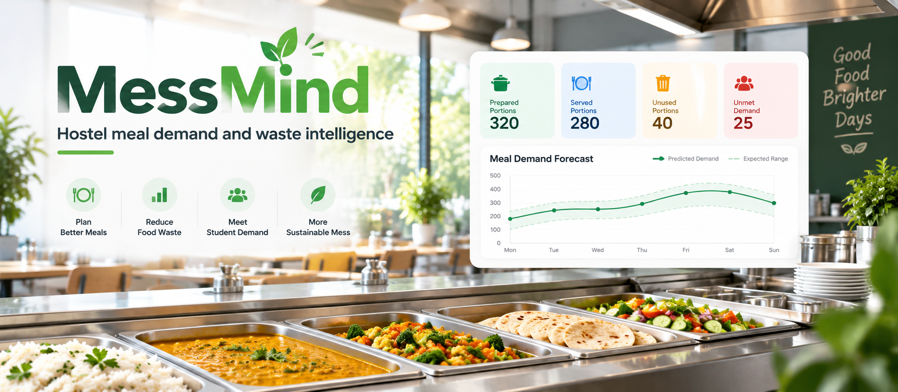

# 🌱 MessMind



**A Python project for reducing hostel meal surplus without hiding unmet demand.**

MessMind starts with a usable meal ledger and grows into an explainable demand-planning application through fourteen daily milestones.

**Current release: Day 1 / v0.1.0 — working ledger and dashboard.** Forecasting is on the roadmap; this release contains no trained ML model.

## The problem

Hostel kitchens must prepare meals before they know exactly how many diners will arrive. Too many portions create surplus; too few leave diners unserved. Looking only at leftovers can make an under-supplied kitchen appear efficient.

MessMind records both sides. Its planned forecasting layer will recommend portions, explain the main drivers and show the trade-off between excess preparation and unmet demand. This is the project's design focus, not a claim that food-demand forecasting is a new invention.

## What works today

- A Streamlit dashboard showing portions prepared, served and unused.
- A weighted unused-portion rate and the share of recorded demand served.
- A cost estimate for unused portions in INR.
- A validated meal-entry form backed by a local SQLite database.
- Protection against duplicate date-and-meal entries and impossible counts.
- An isolated demo with 84 synthetic meal records covering 28 days.
- Automated core and UI-flow tests, plus a daily development roadmap.

No API key, paid service or downloaded dataset is required. The application runs locally.

## Run on Windows

Install Python 3.12, download the project, extract it and open a terminal in the folder containing `app.py`.

```powershell
py -3.12 -m venv .venv
.venv\Scripts\python -m pip install -r requirements.txt
.venv\Scripts\python -m streamlit run app.py
```

Open the local address printed in the terminal, usually `http://localhost:8501`.

## Run on macOS / Linux

```bash
python3 -m venv .venv
.venv/bin/python -m pip install -r requirements.txt
.venv/bin/python -m streamlit run app.py
```

## Try it

1. Open **Demo kitchen** to explore clearly labelled synthetic data.
2. Choose **My kitchen**, then open **Meal log**.
3. Enter a completed meal: 200 prepared, 180 served, 0 unserved, cost ₹30.
4. The dashboard shows 20 unused portions, 10% unused preparation and ₹600 unused portion value.
5. For a different meal, enter 180 prepared, 180 served and 20 unserved. That meal has zero surplus but only 90% of recorded demand served.

Only actual logged records are saved in `data/meals.db`. Demo data never goes into that database. The database is excluded from Git. Make your own backup of it before moving or replacing the project folder.

## How metrics work

| Metric | Calculation |
|---|---|
| Unused portions | Prepared − served |
| Recorded demand | Served + unserved requests |
| Unused portion rate | Total unused ÷ total prepared × 100 |
| Recorded demand served | Total served ÷ total recorded demand × 100 |
| Unused portion value | Sum of unused portions × that meal's entered cost |

Rates use aggregate totals rather than an average of meal percentages. A zero denominator is shown as unknown. Money is rounded to two decimal places after decimal aggregation.

An unused portion is not necessarily discarded food. This release does not measure kilograms, plate waste, donations, actual savings or environmental impact. Costs are user estimates. Unserved requests must be recorded explicitly; the app cannot infer people who left without registering a request.

## Test

```bash
python -m unittest discover -s tests -v
```

Use your virtual environment's Python executable if the environment is not activated. Tests create temporary databases and do not modify your kitchen ledger. The core-only suite has no third-party dependencies:

```bash
python -m unittest tests.test_core -v
```

## Project map

| File | Purpose |
|---|---|
| `app.py` | Streamlit interface |
| `messmind/models.py` | Meal data and validation |
| `messmind/storage.py` | SQLite persistence |
| `messmind/analytics.py` | Transparent metrics |
| `messmind/demo.py` | Synthetic demonstration records |
| `tests/` | Correctness and UI-flow checks |
| `ROADMAP.md` | Daily milestones and acceptance criteria |
| `progress.json` | Machine-readable development progress |
| `docs/DAILY_DEVELOPMENT.md` | Instructions for daily implementation |

## Current boundaries

Day 1 supports one kitchen, one record per date and meal, and comparable portion sizes. Editing, import, forecasting and hosted multi-user access are future work. Run it locally; authentication is not implemented. Do not upload real meal databases, secrets or individual diner details to the repository.

## Daily progress

Each development day should deliver one implemented, tested milestone with a meaningful commit. See [ROADMAP.md](ROADMAP.md) and [CHANGELOG.md](CHANGELOG.md). Scheduled development is configured separately after the GitHub repository exists; this code alone does not schedule commits.

## Technical references

- [Streamlit forms](https://docs.streamlit.io/develop/concepts/architecture/forms)
- [Streamlit AppTest](https://docs.streamlit.io/develop/api-reference/app-testing/st.testing.v1.apptest)
- [Python sqlite3](https://docs.python.org/3/library/sqlite3.html)
